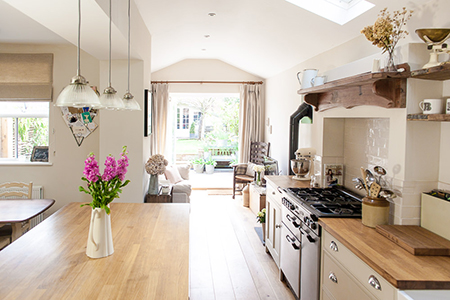
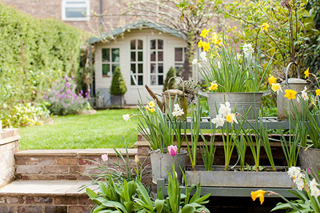
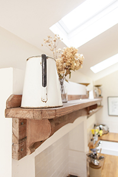

<!DOCTYPE html>
<html lang="en">

<head>
    <meta charset="UTF-8">
    <meta name="viewport" content="width=device-width, initial-scale=1.0">
    <meta http-equiv="X-UA-Compatible" content="ie=edge">
    <title>Portfolio Grid</title>
    <link rel="stylesheet" href="portfolio-grid-gallery4.css">
</head>

<body>
    

        

            

                
Rositsa Stoeva

                
graphic designer

            

            <ul id="menu">
                <li><a href="index.md">PRINT DESIGN</a></li>
                <li class="active-btn">PAINTINGS</li>
                <li>ABOUT</li>
            </ul>
        

        

            

            

        

    

    

        

            

            

            

            

            

            

            

            

            

            

            

            

            

        

    

    

        

            

            

        

        

    

    

</body>

</html>
